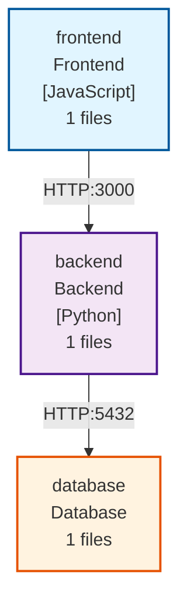

# RepoNexus Examples

Este archivo contiene ejemplos de uso de RepoNexus y los resultados esperados.

## Ejemplo 1: Aplicación Web Simple

### Estructura del Proyecto

```
my-app/
├── frontend/       # React/Vue frontend
│   └── app.js
├── backend/        # Python API
│   └── server.py
└── database/       # SQL scripts
    └── schema.sql
```

### Comando

```bash
reponexus my-app --style c4
```

### Resultado



## Ejemplo 2: Microservicios

### Estructura del Proyecto

```
microservices/
├── api-gateway/    # Node.js gateway
├── user-service/   # Python service
├── order-service/  # Go service
└── notification/   # Python service
```

### Detección Automática

RepoNexus detecta:
- **Lenguajes**: Python, JavaScript, Go
- **Relaciones**: API calls, HTTP connections
- **Arquitectura**: Microservicios pattern

## Ejemplo 3: Monorepo

### Comando Verbose

```bash
reponexus . --verbose --output architecture.mmd
```

### Salida Verbose

```
Analyzing repository: /path/to/repo
Found 4 subsystems:
  - frontend: JavaScript, HTML (45 files)
  - backend: Python (32 files)
  - api: Python (18 files)
  - scripts: Python, Bash (12 files)

Analyzing relationships...
Found 5 relationships:
  - frontend --> api [API]
  - api --> backend [Import]
  - frontend --> backend [HTTP:8000]
  - scripts --> backend [Import]
  - api --> backend [HTTP:5432]

Generating simple diagram...
Diagram saved to: architecture.mmd
Done!
```

## Patrones Detectados

RepoNexus busca automáticamente:

### 1. Puertos y URLs
```python
# Backend detecta puerto 3000
PORT = 3000
app.run(port=PORT)
```

```javascript
// Frontend conecta al puerto 3000
fetch('http://localhost:3000/api/users')
```

### 2. Endpoints API
```python
# Backend expone /api/users
@app.route('/api/users', methods=['GET'])
def get_users():
    pass
```

```javascript
// Frontend consume /api/users
const users = await fetch('/api/users')
```

### 3. Imports/Dependencias
```python
# Importa desde otro módulo
from backend.models import User
```

## Tips de Uso

1. **Organización**: Mantén subsistemas en carpetas de nivel 1
2. **Nomenclatura**: Usa nombres descriptivos (frontend, backend, api)
3. **Código claro**: Los patrones de conexión deben estar en el código
4. **Visualización**: Usa [Mermaid Live Editor](https://mermaid.live/) para visualizar

## Limitaciones

- Solo analiza carpetas de nivel 1
- Requiere patrones explícitos en el código
- No ejecuta el código, solo lo analiza estáticamente
