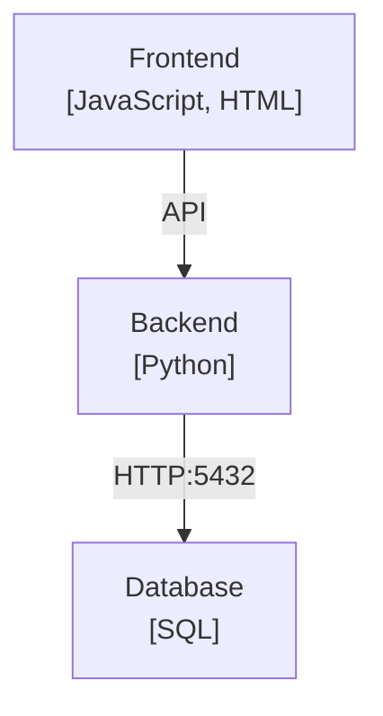

# RepoNexus

Automatiza el análisis de arquitectura en proyectos multi-lenguaje. Escanea la estructura de carpetas para identificar subsistemas (Frontend, Backend, Scripts) e infiere relaciones analizando imports y llamadas HTTP/API en el código. Genera diagramas visuales (Mermaid.js) instantáneos para entender cómo se conectan las piezas de tu monorepo.

## Características

- 🔍 **Detección Automática**: Analiza subcarpetas de nivel 1 como nodos/subsistemas
- 🌐 **Multi-lenguaje**: Detecta Python, JavaScript, TypeScript, Java, Go, Ruby, PHP, y más
- 🔗 **Análisis de Relaciones**: Encuentra conexiones mediante:
  - Puertos y URLs locales
  - Llamadas API y endpoints
  - Imports entre módulos
- 📊 **Diagramas Mermaid.js**: Genera visualizaciones instantáneas de arquitectura
- 🎨 **Múltiples Estilos**: Diagramas simples o estilo C4 detallado

## Instalación

```bash
# Clonar el repositorio
git clone https://github.com/Diegodepab/RepoNexus.git
cd RepoNexus

# Instalar el paquete
pip install -e .
```

## Uso

### Uso Básico

```bash
# Analizar el directorio actual
reponexus .

# Analizar un repositorio específico
reponexus /path/to/repo

# Guardar el diagrama en un archivo
reponexus . --output diagram.mmd
```

### Opciones Avanzadas

```bash
# Generar diagrama estilo C4 (más detallado)
reponexus . --style c4

# Modo verbose para ver el proceso
reponexus . --verbose

# Combinar opciones
reponexus /path/to/repo --style c4 --output architecture.mmd --verbose
```

### Visualizar el Diagrama

Puedes visualizar los diagramas generados en:
- [Mermaid Live Editor](https://mermaid.live/)
- GitHub (soporte nativo en Markdown)
- VS Code con extensión Mermaid
- Cualquier herramienta compatible con Mermaid.js

## Arquitectura del Proyecto

RepoNexus está organizado en módulos:

- **scanner.py**: Detecta subsistemas (carpetas nivel 1) y lenguajes de programación
- **logic.py**: Analiza el código para encontrar relaciones entre subsistemas
- **renderer.py**: Genera diagramas Mermaid.js a partir del análisis
- **cli.py**: Interfaz de línea de comandos

## Ejemplo de Salida



## Licencia

MIT License - ver archivo [LICENSE](LICENSE)
